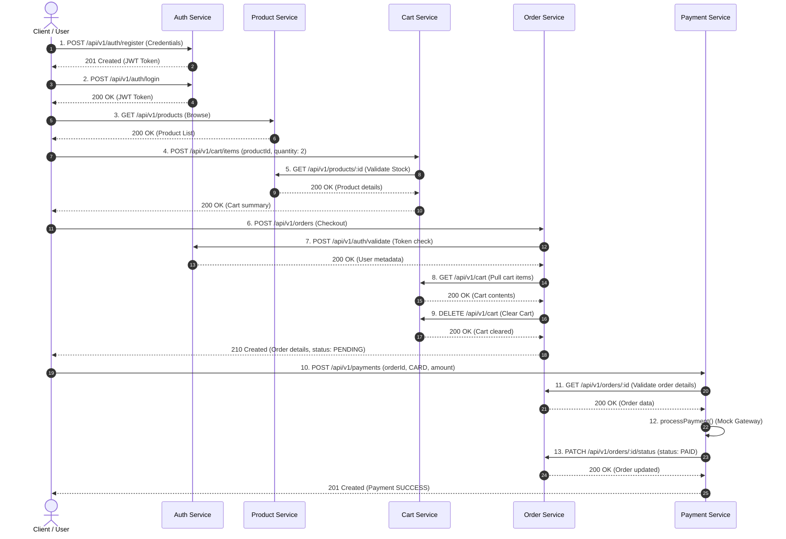

# CMart API Communication & E2E Workflows

This document specifies the communication contracts, request-response layouts, authentication flows, error propagation models, and the E2E checkout journey.

---

## 🔒 1. API Communication Specifications

### Uniform Request Flow
- All REST APIs follow the versioned prefix structure: `/api/v1/`.
- Interactive requests must supply appropriate payload structures (JSON format).

### Standard Response Format
A successful API response returns:
```json
{
  "success": true,
  "message": "Resource retrieved successfully",
  "data": { ... }
}
```

### Authentication Header Propagation
Authentication is handled using stateless JWT (JSON Web Tokens). Secure endpoints require the token in the request header:
```http
Authorization: Bearer <JWT_Token>
```

---

## 🔄 2. E2E Checkout Workflow Sequence

The sequence diagram below visualizes the complete lifecycle: User Registration $\rightarrow$ Login $\rightarrow$ Adding items to cart $\rightarrow$ Checkout $\rightarrow$ Payment validation $\rightarrow$ Order status changes:



---

## 🚫 3. Error Propagation Schema

All microservices capture exceptions globally using the shared `errorHandler` middleware. When a failure occurs, the server responds with a standardized nested JSON error model:

```json
{
  "success": false,
  "error": {
    "code": "NOT_FOUND",
    "message": "Order with ID db45f9f2-e0d8-4345-bd93-eb34fb828516 not found",
    "service": "order-service",
    "timestamp": "2026-07-17T15:10:04.125Z",
    "requestId": "e44d32a2-bd83-47c0-b490-70806edaf95f"
  }
}
```

- **Downstream Exception Interceptions:** Custom HTTP client layers map downstream errors (e.g. Cart service offline) into descriptive upstream error codes like `BAD_GATEWAY` or `SERVICE_UNAVAILABLE` rather than exposing raw node crashes.
