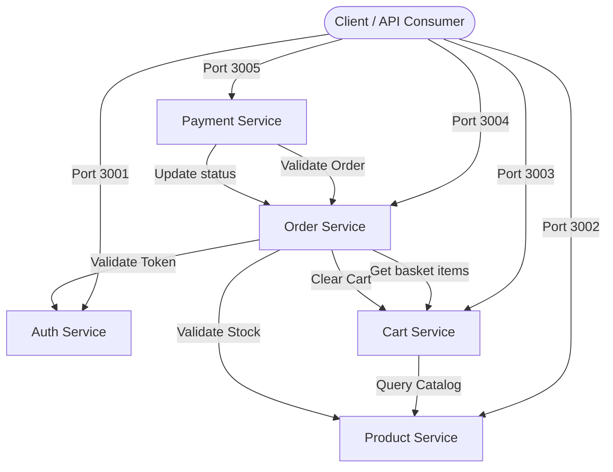

# CMart Backend Architecture Specification

This document presents the detailed architectural design of the CMart microservices platform, explaining our core decisions on database isolation, service boundaries, data ownership, and inter-service communications.

---

## 🗺️ 1. Architecture Diagram

The system map below illustrates the boundaries, entry ports, and inter-service call routing:

---

## 🗃️ 2. Data Ownership & Database Isolation

A central design pillar of CMart is a strict **Database-per-Service** pattern. 

### Why Databases are Isolated
- **Domain Autonomy:** Each team can deploy, scale, and modify their microservice schemas independently without database coupling regressions.
- **Scale Independence:** Cart Service (high write load, short-lived records) can scale its persistence parameters without locking order archives.
- **Zero Cross-Service DB Queries:** Microservices are strictly forbidden from joining database tables belonging to other services. 

### Communication Layer Autonomy
Because direct database access is blocked, all inter-service operations are routed through REST APIs:
- If Cart Service needs the name of a product, it calls `GET /api/v1/products/:id` on the Product Service.
- If Order Service needs to check order items, it queries the Cart Service REST client.

---

## 🧠 3. Microservice Ownership Boundaries

### Auth Service
- **Domain:** User identity, login verification, password hashing, and session refresh logic.
- **Entities Owned:** `User`, `RefreshToken`.

### Product Service
- **Domain:** Item listings, descriptions, active listing statuses, and stock levels.
- **Entities Owned:** `Product`.

### Cart Service
- **Domain:** Shopping sessions, line items, and quantities.
- **Entities Owned:** `Cart`, `CartItem`.

### Order Service
- **Domain:** Purchase logs, order item immutable snapshots, and order checkout state machines.
- **Entities Owned:** `Order`, `OrderItem`.

### Payment Service
- **Domain:** Card charge transactions, mock gateway validations, and refund requests.
- **Entities Owned:** `Payment`.

---

## 🛠️ 4. Key Architectural Decisions (ADR)

### ADR 001: Database-per-Service Pattern
- **Decision:** Each service runs its own isolated database instance.
- **Rationale:** Ensures clean domain boundaries and guarantees that services cannot query or write to tables owned by other services directly, preventing tight schema coupling.

### ADR 002: REST-over-HTTP Inter-Service Communication
- **Decision:** Communicate synchronously using standard REST HTTP requests (via custom `ApiClient` classes wrapping Axios).
- **Rationale:** Simpler setup and contract verification. Resiliency is ensured using exponential retries and stateful circuit breaking.

### ADR 003: Shared Operational Module
- **Decision:** Consolidate error mapping, logging interceptors, config validation schemas, and monitoring route utilities into a single NPM workspace folder `shared`.
- **Rationale:** Prevents code duplication of core cross-cutting concerns while enforcing consistent format schemas (like unified JSON error formats) across the codebase.

### ADR 004: Symmetric JWT Auth Verification (HS256)
- **Decision:** Use a shared symmetric key signature (`JWT_SECRET`) to sign and verify JSON Web Tokens.
- **Rationale:** Extremely fast validation and simple configuration. *Note: In future production roadmaps, this will transition to asymmetric RS256/ES256 signatures.*

### ADR 005: Standardized Health & Readiness Probes
- **Decision:** Expose `/health`, `/ready`, and `/version` endpoints across every microservice.
- **Rationale:** Ensures the application is compatible with container health checking in orchestration systems (Docker, Kubernetes, AWS ECS) and load balancers.
